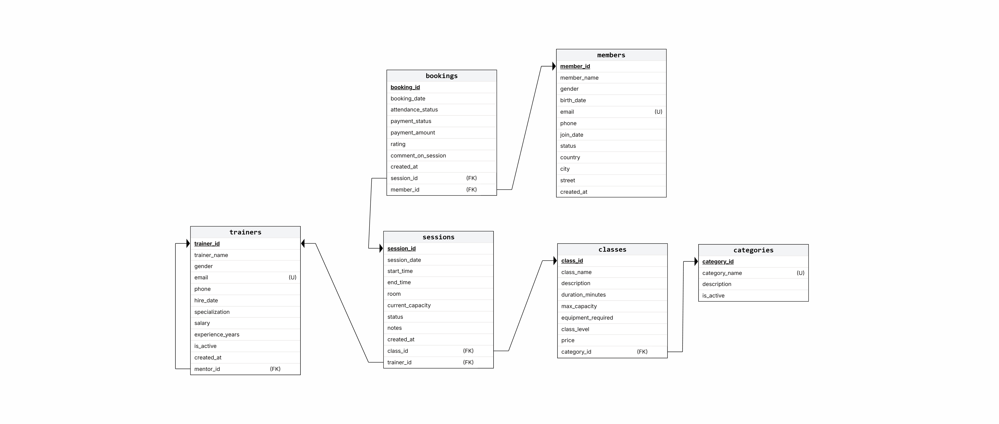

# FitZone Database System

A PostgreSQL portfolio project for gym membership, trainers, classes, scheduled sessions, bookings, reporting, PL/pgSQL automation, security roles, and auditing.

## What is included

- Normalized relational schema with keys, constraints, and indexes
- Repeatable sample data
- Ten reporting and analytics queries
- SQL and PL/pgSQL functions
- Safe booking and member-status procedures
- Capacity, rating, loyalty, and audit triggers
- Least-privilege role example with runtime password prompts
- Transactional smoke and permission tests
- Automated PostgreSQL validation with GitHub Actions
- Schema diagram in `docs/fitzone-schema-diagram.png`

## Database schema



## Requirements

A currently supported PostgreSQL release updated to its latest minor version, and the `psql` command-line client.

## Create and load the database

From this repository root:

```powershell
createdb fitzone_db
psql -v ON_ERROR_STOP=1 -d fitzone_db -f sql/01_schema.sql
psql -v ON_ERROR_STOP=1 -d fitzone_db -f sql/02_seed_data.sql
psql -v ON_ERROR_STOP=1 -d fitzone_db -f sql/04_functions_and_triggers.sql
```

Run the portfolio queries:

```powershell
psql -v ON_ERROR_STOP=1 -d fitzone_db -f sql/03_queries.sql
```

Run the smoke tests; they finish with `ROLLBACK` and leave the sample data unchanged:

```powershell
psql -v ON_ERROR_STOP=1 -d fitzone_db -f tests/manual_tests.sql
```

To rebuild from scratch, rerun the numbered setup files beginning with `01_schema.sql`. That file intentionally drops and recreates only this project's tables.

## Optional role example

Review `sql/05_roles.example.sql`, connect as a PostgreSQL administrator, and run:

```powershell
psql -v ON_ERROR_STOP=1 -d fitzone_db -f sql/05_roles.example.sql
```

The script securely prompts for the `fitzone_readonly` and `fitzone_manager` passwords instead of storing them in SQL or command history.

PostgreSQL roles are shared across the database cluster. Review the database and role names before running the script on a shared or production server.

## Permission tests

For an isolated local or CI database, apply the role policy without assigning login passwords and then run the permission tests:

```powershell
psql -v ON_ERROR_STOP=1 -v skip_passwords=1 -d fitzone_db -f sql/05_roles.example.sql
psql -v ON_ERROR_STOP=1 -d fitzone_db -f tests/security_tests.sql
```

`tests/security_tests.sql` verifies that:

- Application roles do not have administrative privileges
- The read-only role cannot modify business data or read audit records
- The manager cannot insert bookings directly or modify audit records
- The manager can execute the validated booking and member-status procedures
- Protected routines use `SECURITY DEFINER` with a fixed trusted `search_path`

The permission tests run inside a transaction and finish with `ROLLBACK`.

## Automated validation

GitHub Actions starts an isolated PostgreSQL 18 service for every pull request and push to `main`. It loads the schema and sample data, installs the routines and role policy, runs the reporting queries, and executes both the smoke tests and permission tests.

## Recommended execution order

1. `sql/01_schema.sql`
2. `sql/02_seed_data.sql`
3. `sql/04_functions_and_triggers.sql`
4. `sql/03_queries.sql` for read-only examples
5. `sql/05_roles.example.sql` as an optional administrator task
6. `tests/manual_tests.sql`
7. `tests/security_tests.sql` after applying the role policy

## Security

- No database passwords, connection URLs, `.pgpass` files, or real personal data are committed.
- Database routines use a fixed trusted `search_path` to prevent object-shadowing attacks.
- Protected write operations use narrowly scoped `SECURITY DEFINER` routines and are unavailable to `PUBLIC`.
- The optional role script revokes public connection and schema-creation privileges, prevents direct booking insertion, and protects audit records from modification.
- Passwords are entered through psql's secure `\password` command instead of being inserted into SQL statements.
- Password prompts are skipped only inside isolated automated validation.
- Production databases should use encrypted connections, regular backups, and a dedicated non-login database owner instead of a superuser.

Always review grants and back up the database before running destructive schema scripts.